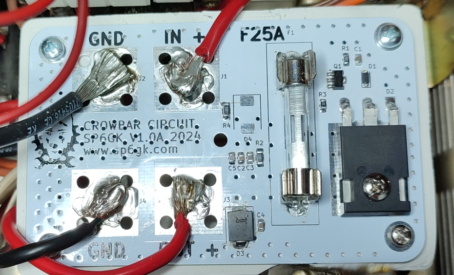
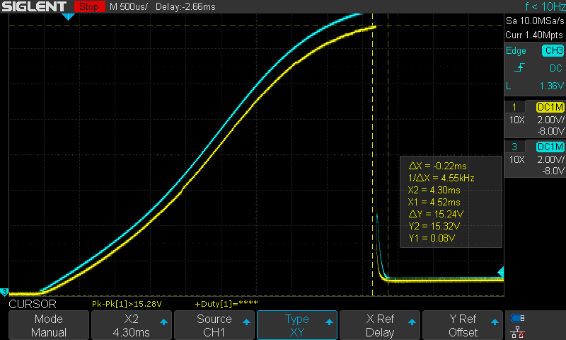
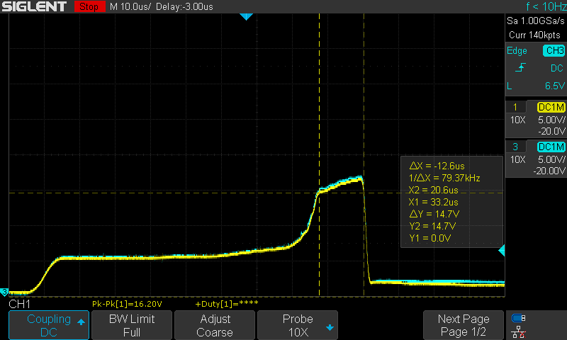
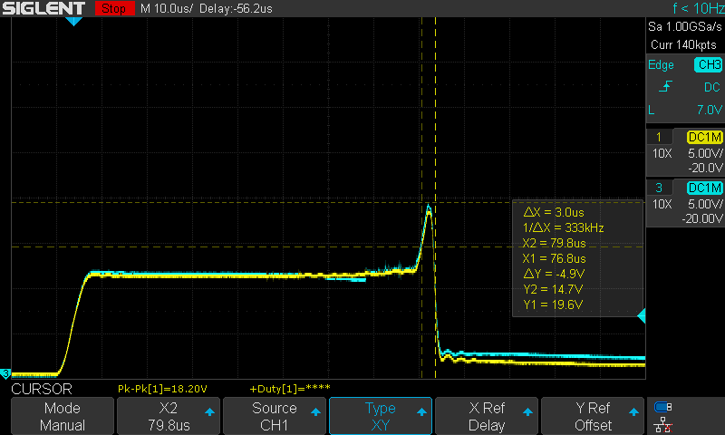

# **Overvoltage Protection Circuit**

This circuit is designed for **overvoltage protection** of amateur radio transceivers, which are typically powered by 13.8 V DC with a current of 20 to 25 A.

---

## **Specification**

- **Default tripping voltage**: 14.7 V  
- **Action time**: < 15 µs (typical ~µ4 s)  
- **Rated current**: Max 25 A
- **Dimension**: 94x59 mm

---

## **Description**

The protection is achieved by **shorting the power supply**, which should blow a fuse and prevent expensive equipment from experiencing a voltage spike. The tripping voltage is approximately **14.7 V**, but it can be adjusted by replacing the Zener diode.  

For **low idle current** and **fast activation** of the triac's gate, the circuit uses an additional transistor in a configuration similar to a Zener-NPN regulator.  

The PCB features space for **M5 screw terminals**, but wires can also be soldered directly and four M3 mounting screws.

> **Recommended Use:**  
> This circuit is especially useful for linear power supplies. In the event of a final transistor(s) fault, a short between the emitter and collector could result in the full rectified voltage being present at the output, which would exceed 13.8 V.  

---

## **PCB Layout**

Below is the layout of the PCB:  

  

---

## **Oscilloscope Screenshots**

The oscilloscope captures below demonstrate the **input (blue, CH2)** and **output (yellow, CH1)** when a sudden 20 V was applied using two parallel 5 A power supplies.  

> Generating consistent transients was challenging, but these scenarios show how the circuit prevented the voltage rail from ramping up and successfully clamped the voltage.  

1. **Transient 1**  
   

2. **Transient 2**  
   

3. **Transient 3**  
   
